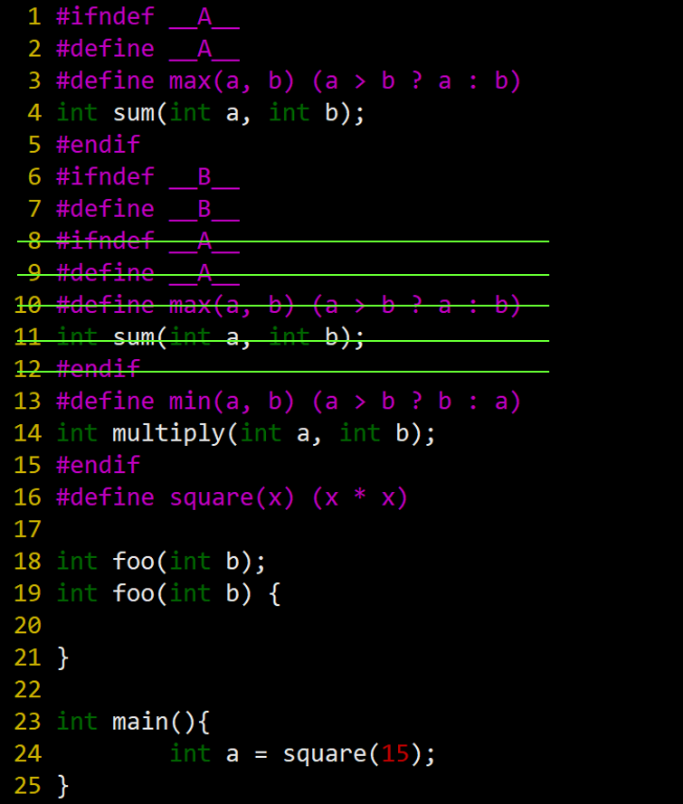

# Solution to Duplicate Inclusion of Header files  

### File: A.h  
```
#ifndef __A__
#define __A__
#define max(a, b) (a > b ? a : b)
int sum(int a, int b);
#endif
```


### File: B.h
```
#ifndef __B__
#define __B__
#include "A.h"
#define min(a, b) (a > b ? b : a)
int multiply(int a, int b);
#endif
```


### File: app.c (Version 1)
```
#include "A.h"
#include "B.h"
#define square(x) (x * x) 

int foo(int b);
int foo(int b) {

}

int main(){
    int a = square(15);
}
```


### File: app.c (Version 2)
```
#ifndef __A__
#define __A__
#define max(a, b) (a > b ? a : b)
int sum(int a, int b);
#endif
#ifndef __B__
#define __B__
#include "A.h"
#define min(a, b) (a > b ? b : a)
int multiply(int a, int b);
#endif
#define square(x) (x * x) 

int foo(int b);
int foo(int b) {

}

int main(){
    int a = square(15);
}
```


### File: app.c (Version 3)
```
#ifndef __A__
#define __A__
#define max(a, b) (a > b ? a : b)
int sum(int a, int b);
#endif
#ifndef __B__
#define __B__
#ifndef __A__
#define __A__
#define max(a, b) (a > b ? a : b)
int sum(int a, int b);
#endif
#define min(a, b) (a > b ? b : a)
int multiply(int a, int b);
#endif
#define square(x) (x * x) 

int foo(int b);
int foo(int b) {

}

int main(){
    int a = square(15);
}
```




### File: app.c (Version 4)
```
int sum(int a, int b);
int multiply(int a, int b);

int foo(int b);
int foo(int b) {

}

int main(){
    int a = (15 * 15);
}
```